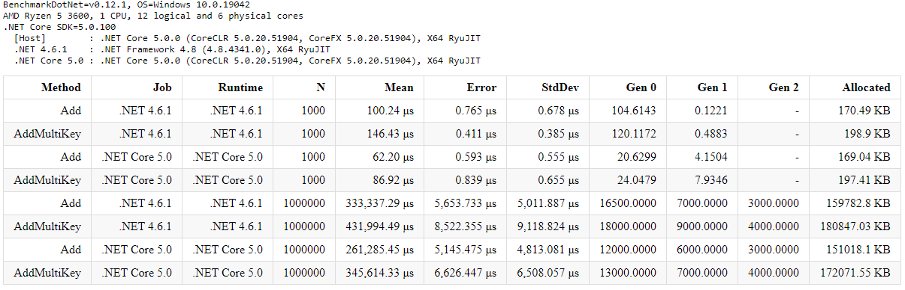
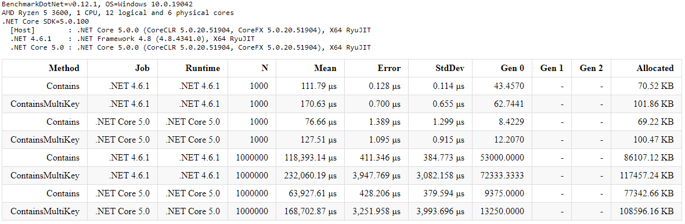
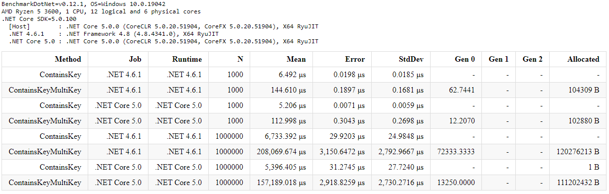
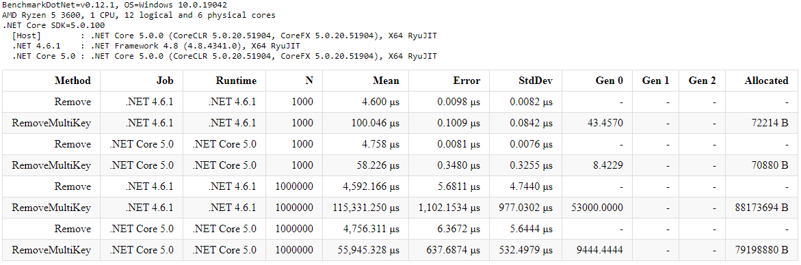
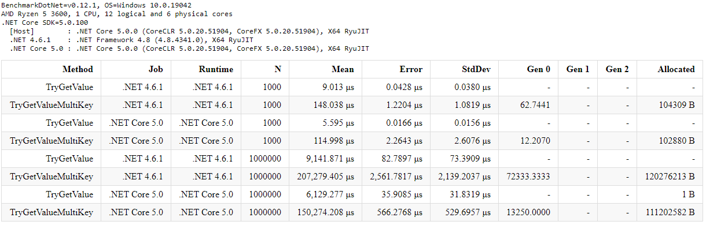

# Multi Key Dictionary

```csharp
//int and string are keys, bool is value.
Dictionary<int, string, bool> dictionary = new Dictionary<int, string, bool>();
```

## Benchmarks

### Add Benchmark


### Contains Benchmark


### ContainsKey Benchmark


### Remove Benchmark


### TryGetValue Benchmark

